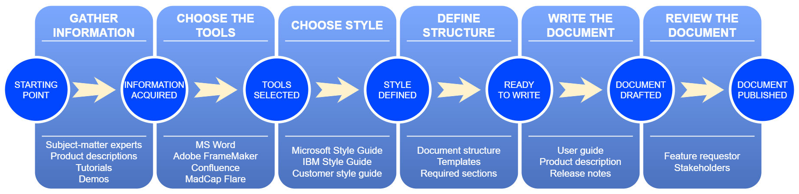

# Module 3: Creating text

>*“All you have to do is write one true sentence. Write the truest sentence that you know.”* 
**
Ernest Hemingway**
## Learning objective
Learn about the key stages of creating text and what lies underneath each stage.
    
## Overview
Text is the primary medium of information, taking on a variety of forms: from fairy tales to scholarly articles. It is easy to create, maintain, and transmit, compared to other types of media. Moreover, it is the most space- and memory-saving way of presenting information.

Text is the substance of technical documentation, therefore the primary skill for any technical writer is writing. Thus, you need to know how to organize the writing process.

The entire  process can be split into six stages:

1. Gathering the required information by any means and via any media at your disposal.
2. Choosing tools for creating your documentation.
3. Selecting the suitable style. At EPAM, technical writers follow the Microsoft Writing Style Guide standards, unless specified otherwise by the customer.
4. Planning the structure of your document.
5. Creating the first draft, polishing it, and sending it to your reviewer if any.
6. Reviewing, updating, and publishing the document.

Let's take a closer look at these stages.

---

## Step 1: Gather information

>*"For all that is secret will eventually be brought into the open, and everything that is concealed will be brought to light and made known to all."*
**
Luke 8:17, New Testament**
    
The key difference between a fiction writer and a technical writer is that the latter relies on precise and detailed information to create texts. For technical writers, only facts and thorough descriptions count.

Thus, to create a comprehensive technical document, you need as much precise and detailed information as possible.

To gather the necessary information, you can use the following methods:

- *Interview subject-matter experts*. For a successful interview, define a proper person, prepare your questions, take notes, or ask if you can record the meeting. If you need clarification, ask immediately. Right after the meeting, open and review your notes. If you missed something, gather your questions and send them via email or set up a follow-up interview until you run out of things to ask. The downside is that it may be problematic to set up a meeting—experts are usually busy with their work.

    >:bulb: Always ask all the questions that you have, no matter how simple or silly they may seem to you—it's better to clarify everything in advance than correct it on the go or miss an important piece of information.
- *Read product and feature descriptions*.
You can gather the required information from developer notes, process descriptions, business requirements, and other related documentation such as product requirements, user stories, JIRA issues, and runbooks. The disadvantage is that usually you need to read many (and sometimes lengthy) texts to find the required information. And sometimes you still may need advice as to what to include and what to omit.
- *Participate in daily meet-ups and team syncs*.
Joining such events can keep you up to date with the current product or software development status. Besides, you can actively participate and give advice when you see room for improvement.
- *Get hands-on experience*.
They say "seeing is believing". If you tailor this expression to the technical communication mindset, it is extremely time-efficient when you can test the software or product yourself, and then write your experience down. However, when you test it yourself, without any additional guidance, you may miss crucial details. Therefore, it is recommended to additionally consult an expert or a person related to the feature development (developer, QA engineer, business analyst, or other team members).
- *Watch video guides and tutorials*.
In some cases, you have to transform videos into textual content. Additionally, tutorials provide essential information without going too deep into detail, and, therefore, can be quite useful. However, this method is often unavailable for software in the prototyping phase or software that only exists as design mock-ups.
- *Attend corporate workshops*.
Some companies and customers organize thorough training sessions for new staff. At these workshops, they explain in detail what their products are, how they work, and what the employees will work with. In some cases, such workshops can be part of the onboarding process and are mandatory; in other cases, you can choose to pass or skip them, especially if have experience with the corporate products.

---

## Step 2: Choose the right tool

> *"Give us the tools, and we will finish the job."*
**
Winston Churchill**
    
After gathering the information and figuring out the required documentation output formats, you need to choose a tool to complete your work.

>:warning: Choosing a tool may not be an option, because your project or customer may already have a certain toolset, and all you can do is master the existing tools to do your work. Nevertheless, you can try recommending something to increase the efficiency and accessibility of your documentation.

The choice of tools depends on many factors, including:

- Document types that you need to create.
- Tool price and license availability.
- Target audience. That is, whether your documentation should be available to any user or restricted to a certain user group.
- Output formats.
- Your experience with different tools.
    
Just to give a few examples:

- For internal compliance documents, use Microsoft Word and SharePoint.
- For HTML help and PDF documents from a single source, consider Adobe FrameMaker, Help+Manual, or MadCap Flare.
- For a knowledge base or internal developer documentation, explore content management systems, such as Confluence that has many integration options.
- For API documentation, choose tools specifically designed to maintain this documentation, such as Swagger, DreamFactory, or Redoc.

To learn more about TW tools, see [Tools and technologies](https://kb.epam.com/display/ETCCC/Tools+and+technologies).

---

## Step 3: Choose a proper style

> *"Simplicity is the ultimate sophistication."*
**
Leonardo da Vinci**
    
You may have noticed that the previous two stages, albeit important, only deal with preparation. But the third stage has a direct strategic impact on creating text.

Choosing a style is extremely important, as it lays the foundation for the entire documentation library for months and years to come. And, unlike regular writers, technical writers have no privilege of writing in long and lexically rich sentences—on the contrary, technical documentation must be straightforward, concise, and devoid of any personal traits and hallmarks. Remember: the sole purpose of technical documentation is to inform and help, but not to entertain or show off.

To ensure that all documentation is unified, clear, and concrete, you can rely on standards for creating documentation, or style guides. Overall, there are numerous style guides for different industries, IT is no exception.

Almost any significant software company that has a large documentation library relies on a particular style guide (either internal or external).

To mention just a few:
- [Microsoft Writing Style Guide](https://docs.microsoft.com/en-us/style-guide/welcome/).
- [Google Developer Documentation Style Guide](https://developers.google.com/style).
- [Apple Style Guide](https://support.apple.com/en-by/guide/applestyleguide/welcome/web).
- [IBM Style Guide](https://www.amazon.com/IBM-Style-Guide-Conventions-Writers/dp/0132101300) (book version).
- [Red Hat Style Guide](https://redhat-documentation.github.io/supplementary-style-guide/).

These guides contain key rules for grammar, word choice, punctuation, and text formatting. Following these rules is essential to keeping your documentation user-friendly and comprehensible.

>:memo: **Remember** No style guide has all the answers for you. Don't treat a style guide as a solution to any issue—use your common sense or consult your colleagues. 
Moreover, different languages have their own sets of rules, so remember that the style guides mentioned here are applicable only to documentation in English.
    
>:warning: Trying to combine several guides into a single "perfect" one may result in a Frankenstein's text. It's better to adhere to a single style guide at least within the same document. The only reason for you to consult another style guide is when you can't find a decent solution to your issue.

Aside from the industry standards, customers can have their corporate style guides. In this case, you will need to study them carefully before typing your first sentence.

Regardless of the style that you choose or have to follow, here are several tips:

- Write in short and clear sentences.
- Avoid complex or ambiguous grammar, such as run-on sentences or phrasal verbs.
- Use identical grammar structures across your documentation.
- Be straight to the point, cut the bulky content.
- Address the user directly, unless required otherwise.
- Use spacing: if a page looks like a wall of text, then most likely you'll need to rewrite it to improve structure and formatting.
- Turn steps in instructions into a numbered list.
    
Altogether, let the KISS (keep it simple and straightforward) principle be your guiding star.

---

## Step 4: Plan your document

>*"A man who does not plan long ahead will find trouble at his door."*
**
Confucius**
    
After choosing the tools and the style guide, you can start planning your document. At this stage, you plan the structure, choose the number of sections and subsections, and predict the information each section needs to contain.

### Structuring the document
The structure depends on the document type, but generally any document includes the following parts:

- The introductory part that familiarizes users with a product or software.
- The starting section that helps users set up the product to better suit their needs and improve their experience.
- The main section, the contents of which depend on the document type. For example:
    - For guides, it is the description of various procedures.
    - For descriptions, it is⁠ the product details.
    - For API documentation⁠, it is various requests, code samples, and other technical information.
- The support section that contains the FAQ and other additional information.
    
Moreover, your document may contain a reference section with key notions, additional descriptions, and an index.

In general, the choice of structure depends on the document type and target audience, as covered by the previous module.

### Organizing the content
    
When you realize what your audience needs, you can organize the content effectively, following these recommendations:

- Keep the content scannable, concise, easy to understand, and consistent.
- Outline the structure, layout, and design. See if you need the assistance of a UX designer.
- Define requirements for visuals, such as resolution, font size in images, and the need for captions.
    
After you have planned the document structure, get down to writing.

---
    
## Step 5: Create the first draft
    
> *"The purpose of the first draft is not to get it right, but to get it written."*
**
John Dufresne**
    
You can't expect to create an excellent document at your first attempt unless you're extremely experienced in writing, using the tools, and perfectly know the product or software that you describe.

A draft is your first attempt to deconstruct the information chaos and order it properly (like sorting LEGO pieces by color before building a 3,000-piece set). Therefore, don't try to create a perfect document right away.

When you begin writing:

1. Start with an introductory sentence that informs users what they can do or accomplish after reading the page.
2. If you are describing a step in a long flow, add prerequisites that must be fulfilled before a user can perform the described action.
3. If you think the user is unfamiliar with the product of software, then walk the user through the entire process from the main menu to the specific location where they need to perform the action (the "every page is page one" approach).
4. Supply your document with screenshots and other additional content that may help the user.
5. Add tips and warnings to steer the user away from wrong paths.
6. Finish your page with a resulting sentence.
7. Repeat the same for other pages.
    
To improve your draft page, follow these recommendations:

- Avoid adding too much information to a page. Remember the rule "one page—one action". For printable documents, you can use subheadings to arrange web pages into logical sections.
- Try to fit your description into seven or fewer steps. Otherwise, consider splitting the page into subpages or use on-page headings.
- Use screenshots wisely. For details, see [Screenshots in documentation—approaches, practices, and tips](https://kb.epam.com/x/oDZuZQ).
- Add links to other pages in your document or to other documents that users can read and learn more about the product.
    
>:bulb: It is a good idea to leave the draft for a day or two, and then review it—you'll notice a lot of points for improvement with a fresh perspective.
    
When you consider the draft ready, send it for review and publishing.
    
You'll read more about useful writing practices in the next module.
    
---
    
## Step 6: Review and publish

> *"We all need people who will give us feedback. That’s how we improve."*
**
Bill Gates**
    
Revision is the final stage before a document is released to the target audience.

A standard review process looks like this:

1. You create and polish your draft.
2. You send the draft document to your stakeholder for review.
3. The reviewer looks through the document, and then either approves the document or provides comments and returns the document for correcting.
    - If the review is unsuccessful, you must correct the document and then repeat step 2. This is called a review or edit loop, and this may happen multiple times.
    - If the review is successful, you may publish the document and pick a new task.
    
### Pain points and painkillers
It is impossible to mention all issues that may occur during review, so this module concentrates on the most common ones.
    
#### Grammar
Technical writers may have different backgrounds, but they all share the same responsibilities. In regard to textual content, you are responsible not only for delivering the information but also for ensuring correct grammar. However, your reviewer may be uninterested in or pay very little attention to grammar, but rather to the information itself. Therefore, don't expect the reviewer to point out all the errors in your document. On the other hand, some reviewers may go overboard and will comment on any phrase that they deem "incorrect". In that case, you have to either accept the comments if they are valid, or try to convince the reviewer that your word choice is a better option.
    
To support your opinion, provide some solid sources, such as dictionaries ([Merriam-Webster](https://www.merriam-webster.com/), [American Heritage](https://ahdictionary.com/), and so on) or other examples of published documents widely considered as exemplary (existing guides, style guides, and the like).
    
>:warning: Using Google search results as a source of truth is quite unreliable, as it may be difficult to identify the author and verify their competence. But if you can validate the source and its credibility, then you can use it.  To check the comparative usage frequency of related words or phrases, you can use the [Google Books Ngram Viewer](https://books.google.com/ngrams/).

#### Non-native language
    
Another pain point may arise if the language of the created documentation is native neither for you nor for the reviewer. That may not be an issue if either of you (or both) are proficient in the language. However, if you don't consider your language level high enough to properly review the linguistic part, then you may ask a third person to review your document, provided they have time to do it.
    
>:bulb: Never give up on improving your language skills—in the long run, it gives you an edge over those who neglect it.

#### When worlds collide
    
Another collision may occur if your reviewers are content creators themselves but of a different kind: a business analyst, UX writer, marketing specialist, or copywriter. Definitely they are proficient in the language, but, like technical writers, they abide by their own content creation standards. And they may try to amend your documents keeping their own standards in mind. If that occurs, you should point out that you are writing according to a widely accepted style guide for technical documentation, and the standards are there for a reason.
   
### Revision checklist

When you feel your content meets the requirements for factual correctness, clarity, and completeness, and all review loops have been completed, run the final checks before publishing your work.
    
>:warning: Remember the power of breaks. Before you start the review, take a longer break to estrange yourself from your text—preferably, do something totally unrelated to text creation. This will help you get a fresher perspective on your document. When you are in the review phase, space out your work—don't try to run the entire list in one go. Five-minute breaks for each half an hour of review might be in order.
    
#### Check text
- Run the spellchecker.
- Check text against a list of words that the regular spellchecker may be oblivious of, such as: "it's" vs "its", "out" vs "our", and so on.
- Check for consistent capitalization, spelling (American English), syntax, and punctuation.
- Check for consistent numbering in procedures, tables, and illustrations if required.
- Ensure consistent naming of all titles and subtitles.
- Check that the table of contents contains all relevant titles.
- Check notes, references, and hyperlinks for consistent formatting.
- Check the validity of internal and external references and hyperlinks.
- Avoid term synonyms and ensure terms are defined and consistently used according to the glossary.
- Check the quotation sources if any.
- Resolve any reviewer comments and remove any revision marks and hidden text.
- Check against the list of abbreviations that they are used properly.
#### Check tables
- Check for mentions in the text.
- Check for consistent formatting and naming.
#### Check illustrations
- Check for any applied copyright rules, acquiring permission to reproduce the material if necessary.
- Check for potentially unwanted cultural connotations.
- Ensure consistent illustration specifications like formatting, callouts, captions, and mentions in the text.
- Ensure that descriptions align with the overall style of the text.
    
To always have the checklist at hand, [download it as a PDF](https://epam.sharepoint.com/:b:/s/EPAMTechnicalCommunicationGlobal/Eb19wuSi3r9DpGIUgQhAoNgBeNggu7UelK6LcV0qZx_TkQ?e=d1vzk1).
    
---

## Conclusion

Creating text isn't solely about writing. It takes time and effort to properly prepare and write a decent document that meets the most stringent standards.
