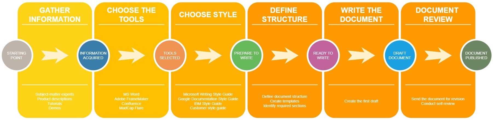

# Module 3: Creating textual content

>*“All you have to do is write one true sentence. Write the truest sentence that you know.”* 
**
Ernest Hemingway**
## Learning objective  

Learn how to present technical information in a clear and comprehensible way:  
- Gathering information.
- Choosing style, tone, and grammar.
- Preparing to write.
- Creating a draft document.
- Reviewing and publishing the document.

## Introduction

Text is the primary source of information in the world, starting from fairy tales to scholarly articles. It is easy to create, maintain, and transmit compared to other types of media.
Moreover, it is the most space- and memory-saving way of presenting information that you want to relay to others. 
But despite total availability, it takes skill and effort to create a text that reaches its goal of informing the target audience. 

In technical communication, textual content is the core of any documentation, therefore the primary skill for any technical writer is *writing*. But, unlike belle-letres, technical documentation must comply with a different set of rules to be considered top-class.

## Overview

The entire writing process can be split into roughly six stages:
1. Gather the required information by any means and via any media at your disposal.
2. Select the proper tool for creating your documentation.
3. Select the proper style and grammar preferences. At EPAM, technical writers follow the [Microsoft Writing Style Guide](https://docs.microsoft.com/en-us/style-guide/welcome/) standards, unless specified otherwise by the customer.
4. Plan the structure of your document and get down to writing.
5. Create your first draft and send it to your project supervisor for review if any.
6. Review, update, and publish the document. This aspect will be covered in [Module 7].

Now, let's have a look at these stages in more detail.

---

## Gathering information

>*"All shall be revealed"*
The key difference between a writer and a technical writer is that the latter relies on precise and detailed information to create texts. Technical writers have no privilege of a stream of consciousness - only facts and thorough descriptions.

Thus, to create a comprehensive technical document, you need as much precise and detailed information as possible.

You can gather the required information via the following methods:
- *Interviewing subject-matter experts*. The easiest and, perhaps, the most efficient method, as you can ask all the questions and receive the expected answers. The downside is that it may be problematic to set up a meeting - some experts can be busy with their work.

    >:bulb: **Tip:** Always ask all the questions that you have, no matter how simple or silly they may seem - it's better to clarify everything beforehand, than correct it on the go or miss an important piece.
- *Reading product and feature descriptions*. You can fish out the required information by reading the developer notes, process descriptions, business requirements, and other related documentation. The disadvantage is that usually you need to tear through vast canvases of text to find the required piece of information. And sometimes you still may need advice as to what you should include and what to omit.
- *Participating in daily meet-ups and team syncs*. Joining such events can keep you up-to-date with the current product or software status. Besides, you can actively participate and give advice if you see room for improvement.
- *Video guides and tutorials*. In some cases, you have to transform videos into textual content. You can call it "Data migration the techcomm way". Additionally, tutorials provide essential information without going too deep into detail, therefore they can be quite useful.
- *Hands-on experience*. They say "seeing is believing". If you tailor it to the techcomm mindset, it is extremely time-efficient if you can test the software or product yourself, and then write it down. However, when you test it yourself, without any additional expertise, you may miss some crucial details. Therefore, it is recommended to additionally consult an expert or a person related to feature development (engineer, tester, analyst, and so on).

Of course, this is not a comprehensive list, but it gives you the understanding of how one can gather information for your future documentation.

---

## Choosing the right tool

> *"Give us the tools, and we will finish the job."*
**
Winston Churchill**
After you've gathered the information and you know what output formats your documentation needs to have, you can choose the proper tool to complete you work. 

>:warning: **Note:** Choosing a tool may not be an option, because your project or customer may already have a certain toolset, and all you can do is master the existing tools to do your work. Nevertheless, you can try to recommend something to increase the efficiency and accessability of your documentation.
The choice of tools depends on many factors, including:
- Document types that you need to create.
- Tool price.
- Document target audience. That is, whether your documentation should be available for any user or restricted to a certain user group.
- Output formats.
- And of course, your experience with different tools.

Just to give a few examples:
- If you need to create internal compliance documents, then perhaps you can rely on MS Word format and SharePoint repository.
- If your client wants to create an HTML help and PDF documents, then a single-source solution is the best option, like Adobe FrameMaker, Help+Manual, or MadCap Flare.
- To create a knowledge base or internal developer documentation, you can rely on a Content Management System, like Confluence, which has many integration options.
- To create API documentation, you can use tools specifically designed to maintain this documentation (Swagger, DreamFactory, and other).

To learn more about TW tools, see [Tools and technologies](https://kb.epam.com/display/ETCCC/Tools+and+technologies?src=contextnavpagetreemode).

After the tool is selected, you can start planning your documentation.

---

## Choosing the proper style

> *"Simplicity is the ultimate sophistication."*
**
Leonardo da Vinci**
You might have noticed that the previous two stages, albeit important, had very obscure relation to creating textual content. But the third stage has direct strategic impact on Writing texts and creating documentation.

Choosing the style is extremely important, as it lays foundation for the entire documentation library for months and years to come. And, unlike regular writers, technical writers have no privilege of writing in long and lexically rich sentences - on the contrary, technical documentation must be straightforward, concise, devoid of any personal traits and hallmarks. Remember, that the one sole purpose of technical documentation is to *inform*, not entertain or show off.

To ensure that all documentation is unified, clear, and concrete, you can rely on standards for creating documentation, or *style guides*. Overall, there are numerous style guides for different spheres of life, IT is no exception.

Almost any significant software company that has large documentation library relies on a particular style guide (either internal or external).

To mention just a few:
- [Microsoft Writing Style Guide](https://docs.microsoft.com/en-us/style-guide/welcome/).
- [Google Developer Documentation Style Guide](https://developers.google.com/style).
- [IBM Style Guide](https://www.amazon.com/IBM-Style-Guide-Conventions-Writers/dp/0132101300) (book version).
- [Red Hat Style Guide](https://redhat-documentation.github.io/supplementary-style-guide/).

These guides contain key rules for grammar, word choice, punctuation, text formatting, and other. Following these rules is key to keeping your documentation user-friendly and comprehensible. 

>:memo: **Remember:** No style guide or rulebook has all the answers for you. Don't treat a style guide as a solution for any issue - use your common sense or consult your colleagues.  
Moreover, different languages have rulesets of their own.
>:warning: Trying to combine several guides into a single "perfect" one may result in a Frankenstein of a text. It's better to adhere to a single style guide at least in the same document. The only reason for your to consult another style guide is when you can't find a decent solution to your issue.

Aside from industry standards, customers can have corporate style guides. In this case, you will need to study them carefully before typing your first sentence.

Regardless of the style that you choose to follow, there are several tips that you should follow:

- Write in short and clear sentences.
- Avoid complex or ambiguous grammar, like long sentences or phrasal verbs.
- Use identical grammatical structures across your documentation.
- Be straight to the point, cut the bulky content.
- Address the user directly, unless required otherwise.

Altogether, let the KIS (keep it simple) principle be your guiding light.

---

## Plan your document

> *"A man who does not plan long ahead will find trouble at his door."*
**
Confucius**
After choosing the tool and style guide, you can start planning your document. On this stage, you can choose the structure, the number of sections and sub-sections, and overall information the document needs to contain.

The structure may vary, depending on the type of document your are about to create, but generally, any document includes the following parts:

- The introductory part that familirizes users with a product or software.
- The starting section that helps users to set up the product to better suit their needs and improve their experience.
- The main section the contents of which depend on the document type: for *guides* it is the description of various procedures; for *descriptions* it is the product details; for *API documentation* it is various attributes, code samples, and other technical information.
- The support section that contains FAQ and support information.

Additionally, your document may contain a reference section with key notions, additional descriptions, and an index.

In general, the choice of structure depends on the document type and target audience. To learn more about documentation types, see [Types of technical documentation](https://clickhelp.com/clickhelp-technical-writing-blog/types-of-technical-documentation/).

When you have planned the document structure, it's hightime you got down to writing.

---

## Create the first draft

> *"The first draft of anything is sh#t."*
**
Ernest Hemingway**
Perhaps Ernest Hemingway was too harsh, but a thing to remember is that you can't expect to create an excellent document in your first attempt. Unless you're extremely experienced in the tools, writing docs, and the product or software that you describe.

A draft is actually your first attempt to decompile the information chaos and order it properly. Therefore, don't try to create a perfect page right away.

When you begin writing:
1. Start with an introductory sentence that informs users what they can do or accomplish after reading the page.
2. If you are describing a step in a long flow, add *preconditions* that must be fulfilled before a user can perform the described action.
3. If you don't know how experienced the user is with the product of software, then walk the user through the entire process from the main menu to the specific location where they need to perform the action (a "page one" approach).
4. Supply your document with screenshots and other additional content that may help them. We'll talk about this aspect in Module 5. 
5. Add tips and warnings to sheer the user away from wrong paths.
6. Finish your page with a resulting sentence.
7. Repeat the same for other pages.

To improve your draft page, follow these recommendations:
- Avoid including too much information into a page. Remember the rule "one page - one action"
- Try to fit your description into *seven* steps. Otherwise, consider splitting tha page into sub-pages or use on-page headings.
- Use screenshots wisely.
- Provide links to other pages in your document or to other documents that users can read and learn more about the product.

We'll provide more writing tips in Module 6.

> :bulb: **Tip:** It is a good idea to leave the draft for a day ot two, and then review it - you'll notice a lot of points for improvements with a fresh view.
When you consider the draft ready, you can send it for review and publishing. We'll cover the review process in Module 7.

---

## Conclusion

As you can see, creating a text doesn't resort to writing - it takes time to properly prepare and create a decent document that meets the most stringent standards. 
