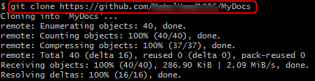
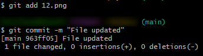

## Скопируйте репозиторий ##
Для копирования репозитория:
1. Скопируйте ссылку на свой репозиторий в GitHub.
2. На своем рабочем компьютере откройте Git или Git Bash.
3. В командной строке введите `git clone` и вставьте скопированную ссылку.

## Внесите изменения в нужные файлы ##
Для внесения изменений:
1. В любом редакторе внесите необходимые изменения в нужном файле и сохраните.
2. В командной строке введите `git add <имя_файла>`.
   >:bulb: Для добавления всех новых и измененных файлов, используйте команду `git add .`.
3. Для сохранения изменений в локальном репозитории введите `git commit -m "<комментарий_к_изменению>?"`.

5. *Опционально*: Проверьте статус изменений в исходном репозитории с помощью команды `git log`. Для выхода из истории изменений, нажмите **q**.

## Сверьте изменения в локальном и удаленном репозиториях ##
Для сверки изменений в репозиториях:
1. Введите `git diff` и просмотрите список изменений.
2. Для переноса свежих изменений из удаленного в свой локальный репозиторий, введите `git fetch`. Система перенесет все новые и обновленные файлы.
3. Выполните одно из следующих действий:
   - Для слияния обеих версий, введите `git merge`.
   - Для внесения своих изменений поверх остальных, введите `git rebase`.
     >:warning: Используйте команду `git rebase` с осторожностью, т.к. могут возникнуть конфликты, если удаленная ветка была серьезно изменена.
 >:bulb: Для слияния обеих версий также можете использовать команду `git pull`.
4. Внесите свои изменения в удаленный репозиторий с помощью команды `git push origin <branch>`, где "branch" - название ветки, в которую необходимо внести изменения. Если изменения вносятся в основную ветку, то вместо *branch* напишите *master* или *main*.
