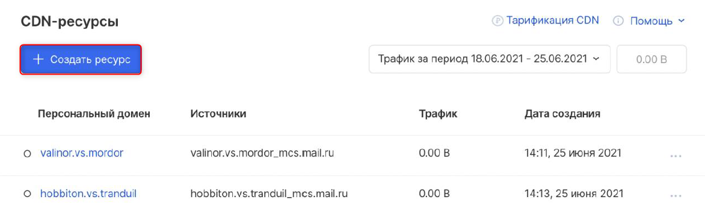
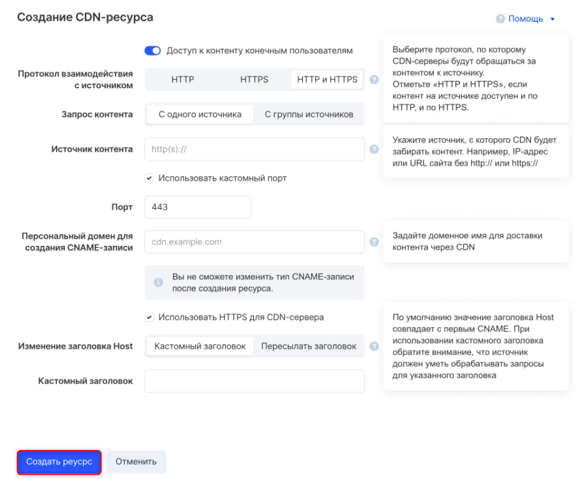

# Создание CND-ресурса #
Для создания CND-ресурса:
1. На странице **CND-ресурсы** нажмите **Создать ресурс**

2. Выполните следующие действия:
    - В **Протокол взаимодействия с источником** выберите **HTTP и HTTPS**.
    - В **Запрос контента** выберите **С одного источника**.
    - В поле **Источник контента** введите нужный адрес, например IP или URL.
    - Отметьте **Использовать кастомный порт**, а затем в поле **Порт** введите *443*.
    - В поле **Персональный домен для создания CNAME-записи** введите нужный домен.
    - Отметьте **Использовать HTTPS для CDN-сервера**.
    - В **Изменение заголовка Host** выберите **Кастомный заголовок**, а затем в поле **Кастомный заголовок** введите нужный текст заголовка.
3. Проверьте введенную информацию и нажмите **Создать ресурс**.

Система создаст ресурс.
